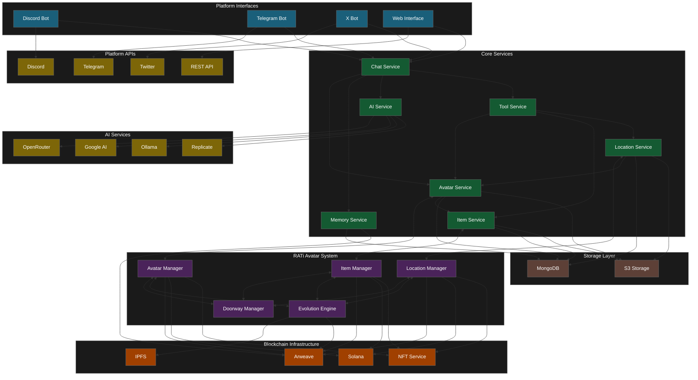

# System Diagram

## System Architecture (Flowchart)

This diagram provides a high-level overview of the system's core components and their interconnections, with a focus on the RATi Avatar System integration.

It illustrates how the **Platform Interfaces** connect with external APIs, how the **Core Services** process and manage data, and how these services interact with both traditional storage and blockchain infrastructure. The diagram shows the system's layered architecture, primary data flow paths, and on-chain/off-chain components.

## RATi Avatar System Flow (Sequence Diagram)

This sequence diagram tracks the lifecycle of an interaction within the RATi Avatar System, showing both on-chain and off-chain processes.

It demonstrates how avatars, items, and locations interact across both traditional database systems and blockchain infrastructure. The diagram illustrates the process from user wallet detection through autonomous decision-making, action execution, and permanent on-chain recording.

**Key Features**

- Wallet monitoring for NFT detection triggers autonomous behavior
- Metadata extraction from on-chain assets guides decisions
- AI-driven autonomous actions based on personality traits
- Cross-platform representation consistency
- Permanent history recording on Arweave
- Burn-to-upgrade evolution mechanism
- Doorway creation for cross-wallet interactions

```mermaid
sequenceDiagram
    participant W as User Wallet
    participant NS as NFT Service
    participant RN as RATi Node
    participant AS as Avatar Service
    participant IS as Item Service
    participant LS as Location Service
    participant AI as AI Service
    participant DB as Database
    participant ARW as Arweave
    
    rect rgb(40, 40, 40)
        note right of W: NFT Detection
        W->>RN: Monitor Wallet Contents
        RN->>NS: Verify NFT Ownership
        NS-->>RN: Return Verified Assets
    end
    
    rect rgb(40, 40, 40)
        note right of RN: Metadata Processing
        RN->>ARW: Fetch Avatar Metadata
        ARW-->>RN: Return RATi Metadata
        RN->>ARW: Fetch Location Metadata
        ARW-->>RN: Return RATi Metadata
        RN->>ARW: Fetch Recent Memory
        ARW-->>RN: Return Memory Context
    end
    
    rect rgb(40, 40, 40)
        note right of RN: Service Integration
        RN->>AS: Register Avatar
        AS->>DB: Store Avatar State
        DB-->>AS: Return Reference
        AS-->>RN: Avatar Ready
        
        RN->>LS: Register Location
        LS->>DB: Store Location State
        DB-->>LS: Return Reference
        LS-->>RN: Location Ready
    end
    
    rect rgb(40, 40, 40)
        note right of RN: Autonomous Decision
        RN->>AI: Process Context
        AI->>AS: Get Personality Traits
        AS-->>AI: Return Traits
        AI->>LS: Get Location Properties
        LS-->>AI: Return Properties
        AI-->>RN: Action Decision
    end
    
    rect rgb(40, 40, 40)
        note right of RN: Action Execution
        alt Item Interaction
            RN->>IS: Use Item
            IS->>AS: Apply Effect
            AS-->>IS: Effect Applied
            IS-->>RN: Action Result
        else Avatar Interaction
            RN->>AS: Interact with Avatar
            AS->>DB: Update Relationship
            DB-->>AS: State Updated
            AS-->>RN: Interaction Result
        else Location Movement
            RN->>LS: Change Location
            LS->>AS: Update Avatar Position
            AS-->>LS: Position Updated
            LS-->>RN: Movement Complete
        else Evolution Process
            RN->>NS: Initiate Burn-to-Upgrade
            NS->>RN: Confirm Burn Transaction
            RN->>AS: Generate New Traits
            AS->>AI: Process Combined Traits
            AI-->>AS: New Avatar Metadata
            AS->>NS: Mint New NFT
            NS-->>AS: New Token ID
            AS-->>RN: Evolution Complete
        end
    end
    
    rect rgb(40, 40, 40)
        note right of RN: Permanent Recording
        RN->>ARW: Store Action Record
        ARW-->>RN: Transaction ID
        RN->>DB: Update Local State
        DB-->>RN: State Synced
    end
    
    RN-->>W: Update Wallet Display
```

## Cross-Platform Representation (Component Diagram)

This component diagram illustrates how the RATi Avatar System maintains consistent representation across multiple platforms while utilizing both on-chain and off-chain storage.

```mermaid
flowchart TD
    subgraph BC["Blockchain Layer"]
        SOL["Solana NFTs"]
        ARW["Arweave Metadata"]
        IPFS["IPFS Media"]
    end
    
    subgraph CM["Core Metadata"]
        AT["Avatar Traits"]
        IT["Item Properties"]
        LT["Location Features"]
        MM["Memory Records"]
    end
    
    subgraph PI["Platform Interfaces"]
        subgraph DC["Discord"]
            DA["Avatar Profiles"]
            DC1["Chat Channels"]
            DL["Location Rooms"]
        end
        
        subgraph TG["Telegram"]
            TA["Avatar Bots"]
            TC["Telegram Chats"]
        end
        
        subgraph XP["X Platform"]
            XA["Avatar Accounts"]
            XT["Tweet Threads"]
        end
        
        subgraph WB["Web Interface"]
            WD["Dashboard"]
            WI["Inventory"]
            WM["Map View"]
        end
    end
    
    %% Blockchain to Metadata
    SOL --> AT
    SOL --> IT
    SOL --> LT
    ARW --> AT
    ARW --> IT
    ARW --> LT
    ARW --> MM
    IPFS --> AT
    IPFS --> IT
    IPFS --> LT
    
    %% Metadata to Platforms
    AT --> DA
    AT --> TA
    AT --> XA
    AT --> WD
    
    IT --> DL
    IT --> TC
    IT --> XT
    IT --> WI
    
    LT --> DL
    LT --> TC
    LT --> XT
    LT --> WM
    
    MM --> DC1
    MM --> TC
    MM --> XT
    MM --> WD
    
    %% Styling
    classDef blue fill:#1a5f7a,stroke:#666,color:#fff
    classDef purple fill:#4a235a,stroke:#666,color:#fff
    classDef orange fill:#a04000,stroke:#666,color:#fff
    
    class SOL,ARW,IPFS orange
    class AT,IT,LT,MM purple
    class DA,DC1,DL,TA,TC,XA,XT,WD,WI,WM blue
    
    style BC fill:#1a1a1a,stroke:#666,color:#fff
    style CM fill:#1a1a1a,stroke:#666,color:#fff
    style PI fill:#1a1a1a,stroke:#666,color:#fff
    style DC fill:#1a1a1a,stroke:#666,color:#fff
    style TG fill:#1a1a1a,stroke:#666,color:#fff
    style XP fill:#1a1a1a,stroke:#666,color:#fff
    style WB fill:#1a1a1a,stroke:#666,color:#fff
```

