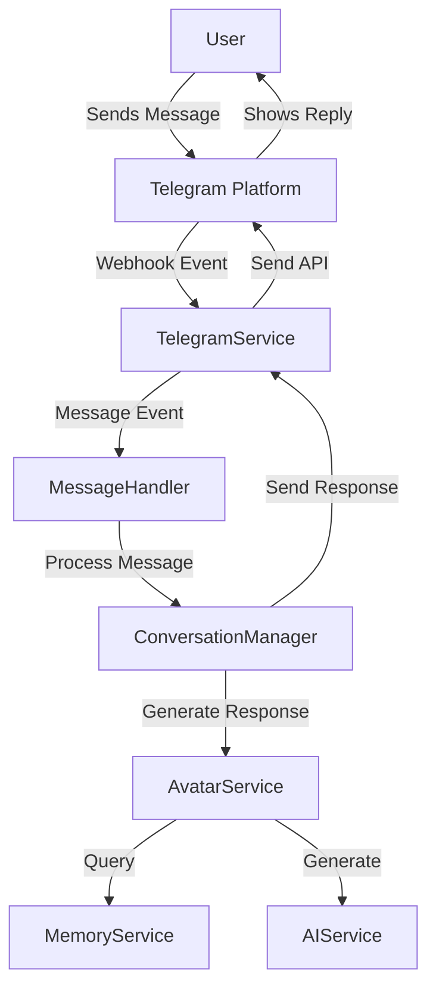

# Telegram Integration (Coming Soon)

## Overview

Telegram integration will expand Moonstone Sanctum's communication capabilities beyond Discord and X, reaching users on one of the world's most popular messaging platforms. This document outlines the planned implementation architecture, features, and timeline for the Telegram integration.

## Planned Architecture

The Telegram integration will follow a similar pattern to our existing social integrations:



## Planned Components

1. **TelegramService**: Core service managing the Telegram Bot API connection
2. **TelegramWebhookHandler**: Processes incoming webhook events from Telegram
3. **TelegramMessageFormatter**: Handles formatting messages specific to Telegram's capabilities
4. **BotFather Integration**: For bot creation and management on Telegram

## Key Features (Planned)

### 1. Bot Interaction

- Create personalized bots for each avatar (or a unified bot)
- Support for both private chats and group conversations
- Command system with `/` prefix
- Inline query support for quick avatar actions

### 2. Rich Media Support

- Image and GIF sharing
- Voice message capabilities
- Sticker pack integration
- Location sharing

### 3. Advanced Messaging Features

- Inline buttons for interactive elements
- Custom keyboards for structured responses
- Message threading and quoting
- Polls and quizzes for engagement

### 4. Multi-User Conversations

- Group chat support with multiple users
- Channel publishing capabilities
- Forum topic support (on compatible clients)

## Technical Implementation Plan

### 1. Core Bot Setup

```javascript
// Planned implementation for TelegramService
export class TelegramService extends BasicService {
  constructor(container) {
    super(container, [
      'logger',
      'configService',
      'databaseService',
    ]);
    
    this.bot = new Telegraf(process.env.TELEGRAM_BOT_TOKEN);
    this.db = services.databaseService.getDatabase();
    this.setupEventListeners();
  }
  
  async initialize() {
    // Setup webhook or polling
    const telegramConfig = this.configService.getTelegramConfig();
    if (telegramConfig.useWebhook) {
      await this.bot.telegram.setWebhook(`${telegramConfig.webhookUrl}/telegram-webhook`);
      this.logger.info('Telegram webhook set up successfully');
    } else {
      this.bot.launch();
      this.logger.info('Telegram bot started in polling mode');
    }
  }
  
  setupEventListeners() {
    // Handle text messages
    this.bot.on('text', async (ctx) => {
      // Process incoming messages
      await this.services.messageHandler.handleTelegramMessage(ctx);
    });
    
    // Handle commands
    this.bot.command('start', async (ctx) => {
      await ctx.reply('Welcome to Moonstone Sanctum!');
    });
    
    // Additional handlers...
  }
  
  async sendMessage(chatId, text, options = {}) {
    try {
      const result = await this.bot.telegram.sendMessage(chatId, text, options);
      return result;
    } catch (error) {
      this.logger.error(`Failed to send Telegram message: ${error.message}`);
      throw error;
    }
  }
  
  // Additional methods...
}
```

### 2. Authentication & User Linking

Users will need to connect their Telegram accounts to their existing Moonstone Sanctum profiles:

```javascript
// Planned implementation for user linking
bot.command('connect', async (ctx) => {
  // Generate unique code for the user
  const linkCode = generateUniqueCode();
  
  // Store pending link request
  await db.collection('telegram_link_requests').insertOne({
    telegramId: ctx.from.id,
    linkCode,
    createdAt: new Date(),
    expiresAt: new Date(Date.now() + 30 * 60 * 1000), // 30 minutes
  });
  
  // Send instructions to user
  await ctx.reply(
    `To connect your Moonstone Sanctum account, use this code on the website: ${linkCode}\n` +
    `The code will expire in 30 minutes.`
  );
});
```

### 3. Database Collections

Planned collections for Telegram integration:

1. **telegram_users**: Links Telegram user IDs to Moonstone Sanctum accounts
   - `telegramId`: Telegram user ID
   - `userId`: Moonstone Sanctum user ID
   - `username`: Telegram username
   - `firstName`: User's first name
   - `lastName`: User's last name
   - `connectedAt`: Connection timestamp
   
2. **telegram_chats**: Stores information about active Telegram chats
   - `chatId`: Telegram chat ID
   - `type`: Chat type (private, group, supergroup, channel)
   - `title`: Chat title (for groups)
   - `activeAvatars`: Array of avatar IDs active in this chat
   
3. **telegram_messages**: Archives Telegram messages for context
   - `messageId`: Telegram message ID
   - `chatId`: Chat ID
   - `senderId`: Sender's Telegram ID
   - `text`: Message content
   - `timestamp`: Sent timestamp
   - `entities`: Special entities in the message

## Security Considerations

1. **Bot Token Protection**: Secure storage and rotation of bot tokens
2. **Webhook Security**: HTTPS endpoints with verification
3. **Message Validation**: Verify authenticity of incoming updates
4. **Rate Limiting**: Prevent abuse and spam
5. **User Privacy**: Clear data usage policies and retention limits

## Implementation Timeline

### Phase 1: Foundation (Q3 2023)
- Research and design document creation
- Core TelegramService implementation
- Basic messaging capabilities
- User account linking

### Phase 2: Core Features (Q4 2023)
- Avatar integration
- Group chat support
- Rich media support
- Command system

### Phase 3: Advanced Features (Q1 2024)
- Interactive elements (buttons, keyboards)
- Integration with existing Moonstone tools
- Analytics and monitoring
- Performance optimization

## Conclusion

The Telegram integration will significantly expand Moonstone Sanctum's reach and capabilities, allowing avatars to interact with users on one of the world's most popular messaging platforms. By following the architecture and implementation plan outlined in this document, we can deliver a robust, secure, and feature-rich Telegram experience that complements our existing social integrations.