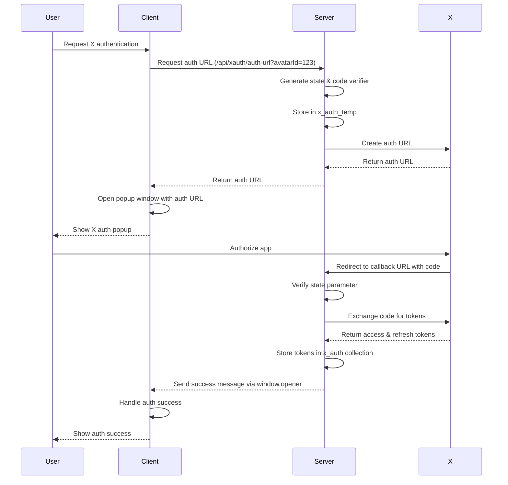

# X (Twitter) Integration

## Overview

Moonstone Sanctum includes a comprehensive integration with X (formerly Twitter) that allows avatars to authenticate, link their X accounts, and interact with the X platform programmatically. This document outlines the end-to-end X authentication and linking lifecycle, including technical details and recommended improvements.

## Authentication Flow

The X authentication system implements the OAuth 2.0 authorization code flow with PKCE (Proof Key for Code Exchange) and includes the following main components:

1. **Client-side Integration**: Implemented in `xService.mjs` in the client's code
2. **Server-side Routes**: Implemented in `xauth.mjs` as Express routes
3. **X Social Tools**: Functionality for X social interactions (`XPostTool.mjs` and `XSocialTool.mjs`)

### Authentication Lifecycle



## Implementation Details

### 1. Client-Side Initialization

When a user initiates X authentication:

```javascript
// From src/services/xService.mjs
export async function initiateXAuth(avatarId) {
  const response = await fetch(`/api/xauth/auth-url?avatarId=${avatarId}`);
  const data = await response.json();
  
  // Open X authentication popup
  window.open(
    data.url,
    'xauth_popup',
    `width=600,height=650,top=${window.screen.height/2-325},left=${window.screen.width/2-300}`
  );
  
  return { success: true, message: 'X authentication initiated' };
}
```

### 2. Server-Side Authorization URL Generation

The server handles the request and generates an authorization URL:

```javascript
// From src/services/web/server/routes/xauth.mjs
router.get('/auth-url', async (req, res) => {
  const { avatarId } = req.query;
  
  // Generate state for CSRF protection
  const state = crypto.randomBytes(16).toString('hex');
  
  // Create X API client
  const client = new TwitterApi({
    clientId: process.env.X_CLIENT_ID,
    clientSecret: process.env.X_CLIENT_SECRET,
  });
  
  // Generate OAuth URL with PKCE
  const { url, codeVerifier } = client.generateOAuth2AuthLink(
    process.env.X_CALLBACK_URL,
    { scope: ['tweet.read', 'tweet.write', 'users.read', 'offline.access'], state }
  );
  
  // Store temporarily for callback verification
  await db.collection('x_auth_temp').insertOne({
    avatarId,
    codeVerifier,
    state,
    createdAt: new Date(),
    expiresAt: new Date(Date.now() + AUTH_SESSION_TIMEOUT),
  });
  
  res.json({ url, state });
});
```

### 3. OAuth Callback Processing

After the user authorizes the application:

```javascript
router.get('/callback', async (req, res) => {
  const { code, state } = req.query;
  
  // Find the temporary auth record
  const storedAuth = await db.collection('x_auth_temp').findOne({ state });
  
  // Exchange the code for tokens
  const { accessToken, refreshToken, expiresIn } = await client.loginWithOAuth2({
    code,
    codeVerifier: storedAuth.codeVerifier,
    redirectUri: process.env.X_CALLBACK_URL,
  });
  
  // Store tokens in database
  await db.collection('x_auth').updateOne(
    { avatarId: storedAuth.avatarId },
    {
      $set: {
        accessToken,
        refreshToken,
        expiresAt: new Date(Date.now() + expiresIn * 1000),
        updatedAt: new Date(),
      }
    },
    { upsert: true }
  );
  
  // Close the popup and notify the opener
  res.send(`
    <script>
      window.opener.postMessage({ type: 'X_AUTH_SUCCESS' }, '*');
      window.close();
    </script>
  `);
});
```

### 4. Wallet Linking

After authentication, users can optionally link their wallet:

```javascript
// Client-side request
export async function connectWalletToXAuth(avatarId, walletAddress, signature, message) {
  const response = await fetch('/api/xauth/connect-wallet', {
    method: 'POST',
    headers: { 'Content-Type': 'application/json' },
    body: JSON.stringify({ avatarId, walletAddress, signature, message })
  });
  
  return await response.json();
}

// Server-side handler
router.post('/connect-wallet', async (req, res) => {
  const { avatarId, walletAddress, signature, message } = req.body;
  
  // Verify signature
  if (!verifyWalletSignature(message, signature, walletAddress)) {
    return res.status(401).json({ error: 'Invalid signature' });
  }
  
  // Update X auth record with wallet address
  await db.collection('x_auth').updateOne(
    { avatarId },
    { $set: { walletAddress, updatedAt: new Date() } }
  );
  
  res.json({ success: true });
});
```

### 5. Token Refresh

When tokens expire, the system refreshes them:

```javascript
async function refreshAccessToken(auth) {
  const client = new TwitterApi({
    clientId: process.env.X_CLIENT_ID,
    clientSecret: process.env.X_CLIENT_SECRET,
  });
  
  const { accessToken, refreshToken: newRefreshToken, expiresIn } = 
    await client.refreshOAuth2Token(auth.refreshToken);
  
  await db.collection('x_auth').updateOne(
    { avatarId: auth.avatarId },
    {
      $set: {
        accessToken,
        refreshToken: newRefreshToken,
        expiresAt: new Date(Date.now() + expiresIn * 1000),
        updatedAt: new Date(),
      },
    }
  );
  
  return { accessToken, expiresAt };
}
```

### 6. X Social Interactions

The system provides X social tools for authenticated avatars:

#### XPostTool
Allows avatars to post to X:

```javascript
// From XPostTool.mjs
async execute(message, params, avatar) {
  // Check auth and retrieve tokens
  const auth = await db.collection('x_auth').findOne({ avatarId: avatar._id.toString() });
  
  // Post to X
  const twitterClient = new TwitterApi(decrypt(auth.accessToken));
  await twitterClient.v2.tweet(messageText);
  
  // Store post record
  await db.collection('social_posts').insertOne({
    avatarId: avatar._id,
    content: messageText,
    timestamp: new Date(),
    postedToX: true
  });
  
  return `✨ Posted to X: "${messageText}"`;
}
```

#### XSocialTool
Provides enhanced social interactions with AI-driven actions:

```javascript
// From XSocialTool.mjs - AI-assisted X interactions
async execute(message, params, avatar) {
  if (command === 'auto') {
    // Get context and X timeline data
    const context = await this.getChannelContext(message.channel);
    const { timeline, notifications } = await this.getXTimelineAndNotifications(avatar);
    
    // Generate AI-driven social actions
    const actions = await this.generateSocialActions(avatar, context, timeline, notifications);
    
    // Execute actions
    for (const action of actions.actions) {
      switch (action.type) {
        case 'post':
          await v2Client.tweet(action.content);
          break;
        case 'reply':
          await v2Client.reply(action.content, action.tweetId);
          break;
        // Additional action types...
      }
    }
  }
}
```

## Data Storage

The X authentication system uses two MongoDB collections:

1. **x_auth_temp**: Temporary storage for authentication state and PKCE code verifier
   - `avatarId`: The avatar being authenticated
   - `codeVerifier`: PKCE code verifier
   - `state`: Random state for CSRF protection
   - `createdAt`: Creation timestamp
   - `expiresAt`: Expiration timestamp (10 minutes)

2. **x_auth**: Permanent storage for X authentication tokens
   - `avatarId`: The authenticated avatar
   - `accessToken`: OAuth access token (should be encrypted)
   - `refreshToken`: OAuth refresh token (should be encrypted)
   - `expiresAt`: Token expiration timestamp
   - `walletAddress`: Associated wallet address (optional)
   - `updatedAt`: Last update timestamp

## Security Considerations

The implementation includes several security features:

1. **PKCE Flow**: Uses code verifier and challenge for additional security
2. **State Parameter**: Prevents CSRF attacks during the OAuth flow
3. **Token Encryption**: Refresh tokens should be encrypted before storage
4. **Wallet Signature Verification**: Validates wallet ownership for linking
5. **Token Refresh**: Handles token expiration and refresh
6. **Temporary Session Cleanup**: Removes expired authentication sessions

## Improvement Plan

### 1. Enhanced Token Security

**Current Status**: The implementation includes token encryption, but it may not be consistently applied across all components.

**Improvements**:
- Ensure all tokens are encrypted at rest using a strong encryption method
- Implement key rotation for encryption keys
- Add a salt to each token's encryption to prevent rainbow table attacks

### 2. Improved Error Handling

**Current Status**: Basic error handling exists but could be more comprehensive.

**Improvements**:
- Add more detailed error logging with correlation IDs
- Implement more graceful degradation when X API is unavailable
- Add retry logic for transient failures
- Create a dashboard for monitoring authentication failures

### 3. User Experience Enhancements

**Current Status**: Basic authentication flow with popup windows.

**Improvements**:
- Add a modal progress indicator during authentication
- Implement silent token refresh when possible
- Add clearer error messages for users
- Provide visual indicators of X connection status
- Add a "reconnect" option when tokens are expired but refresh tokens are invalid

### 4. Rate Limiting and Quotas

**Current Status**: No explicit handling of X API rate limits.

**Improvements**:
- Implement client-side rate limiting to prevent quota exhaustion
- Add a queue system for high-volume posting scenarios
- Implement backoff strategies for rate limit errors
- Add monitoring for quota usage

### 5. Enhanced X Features

**Current Status**: Basic posting, replying, and timeline viewing.

**Improvements**:
- Add support for media uploads (images, videos)
- Implement thread creation capabilities
- Add analytics for X engagement
- Support X Spaces creation and management
- Add support for list management

### 6. Advanced AI Integration

**Current Status**: Basic AI-driven social actions.

**Improvements**:
- Enhance persona consistency in X interactions
- Add sentiment analysis for appropriate responses
- Implement time-aware posting strategies
- Add context-aware response generation
- Develop engagement optimization algorithms

### 7. Compliance and Privacy

**Current Status**: Basic OAuth compliance.

**Improvements**:
- Add explicit user consent tracking
- Implement data retention policies
- Add user data export capabilities
- Implement detailed audit logging
- Add compliance reporting features

## Implementation Timeline

1. **Phase 1 (1-2 weeks)**
   - Implement token encryption improvements
   - Enhance error handling
   - Add basic monitoring

2. **Phase 2 (2-3 weeks)**
   - Improve user experience
   - Implement rate limiting
   - Add media upload support

3. **Phase 3 (3-4 weeks)**
   - Enhance AI integration
   - Add analytics
   - Implement compliance features

4. **Phase 4 (Ongoing)**
   - Monitor and improve based on usage patterns
   - Add new X platform features as they become available
   - Scale systems based on demand

## Conclusion

The X authentication and integration system provides a robust foundation for avatar interactions with the X platform. By implementing the improvement plan, we can enhance security, reliability, and functionality while providing a better user experience and more powerful social capabilities.

With these enhancements, avatars will be able to maintain a consistent and engaging presence on X, leveraging AI-driven interactions while maintaining high security standards and compliance with platform policies.