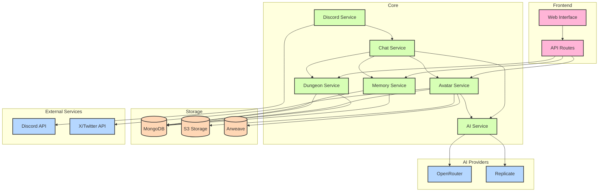

```mermaid
graph TB
    subgraph Frontend
        WEB[Web Interface]
        API[API Routes]
    end

    subgraph Core
        DS[Discord Service]
        CS[Chat Service]
        AS[Avatar Service]
        MS[Memory Service]
        AIS[AI Service]
        DUN[Dungeon Service]
    end

    subgraph AI Providers
        OR[OpenRouter]
        REP[Replicate]
    end

    subgraph Storage
        MONGO[(MongoDB)]
        S3[(S3 Storage)]
        ARW[(Arweave)]
    end

    subgraph External Services
        DISCORD[Discord API]
        X[X/Twitter API]
    end

    %% Frontend Connections
    WEB --> API
    API --> AS
    API --> MS
    API --> DUN

    %% Core Service Connections
    DS --> CS
    CS --> AS
    CS --> MS
    CS --> AIS
    CS --> DUN
    AS --> AIS
    AS --> S3
    AS --> ARW
    MS --> MONGO
    DUN --> MONGO

    %% AI Provider Connections
    AIS --> OR
    AIS --> REP

    %% External Service Connections
    DS --> DISCORD
    AS --> X

    %% Database Connections
    AS --> MONGO
    DUN --> MONGO
    MS --> MONGO

    classDef default fill:#f9f9f9,stroke:#333,stroke-width:2px;
    classDef storage fill:#ffd7b5,stroke:#333;
    classDef external fill:#b5d7ff,stroke:#333;
    classDef core fill:#d7ffb5,stroke:#333;
    classDef frontend fill:#ffb5d7,stroke:#333;

    class MONGO,S3,ARW storage;
    class DISCORD,X,OR,REP external;
    class DS,CS,AS,MS,AIS,DUN core;
    class WEB,API frontend;
```
