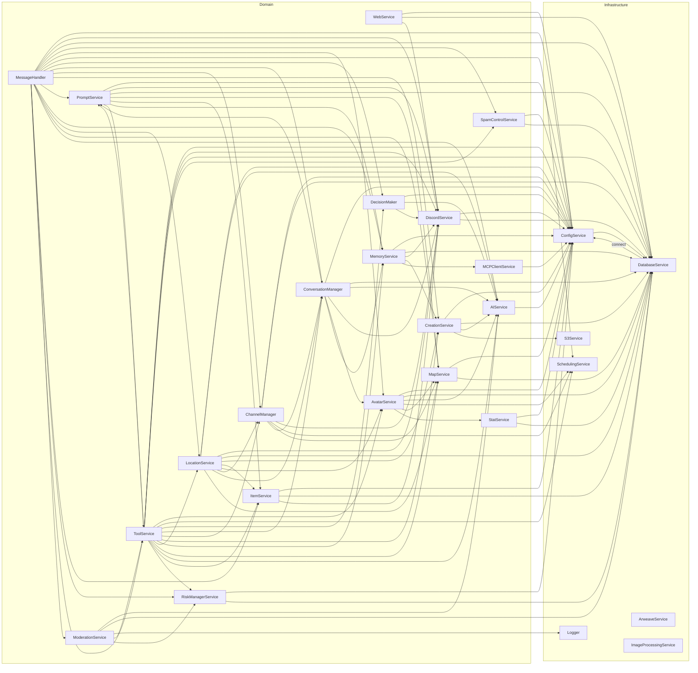

# Service Registry

## Overview
The ServiceRegistry configures the Container with all available services in the system. It acts as the central configuration point for service registration, defining how services are created and their lifecycle options.

## Functionality
- **Service Configuration**: Defines all available services
- **Dependency Management**: Configures service creation with container-based dependency injection
- **Shared Container**: Exports a configured container instance for the entire application

## Implementation
The ServiceRegistry imports the Container and all service classes that need to be registered. It then creates a container instance and registers each service with its factory function and options.

```javascript
import { Container } from './container.mjs';
import { BasicService } from '../foundation/basicService.mjs';
import { SchedulingService } from '../scheduler/scheduler.mjs';

const container = new Container();

// Register logger
container.register('logger', () => console);

// Register BasicService as a test service
container.register('basic', (c) => new BasicService(c));
// Register SchedulingService
container.register('schedulingService', (c) => new SchedulingService(c));

export { container };
```

## Usage
The ServiceRegistry exports a pre-configured container that can be imported by other modules to resolve services:

```javascript
import { container } from './serviceRegistry.mjs';

// Resolve a service
const schedulingService = container.resolve('schedulingService');
```

The ServiceInitializer also uses the registry to access services during the application startup process.

## Dependencies
- Container
- All service classes that need to be registered

# Service Dependency Graph

