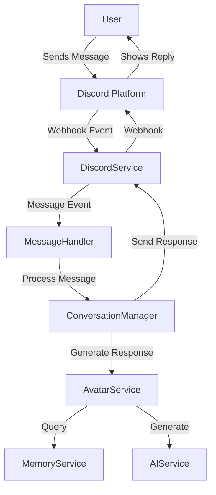

# Discord Integration

## Overview

Discord serves as the primary communication platform for Moonstone Sanctum, enabling avatar interactions with users through channels, direct messages, and guild-based communities. This document outlines the Discord integration architecture, implementation details, and planned improvements.

## Components

The Discord integration consists of several interconnected components:

1. **DiscordService**: Core service managing the Discord.js client connection and webhook utilities
2. **ConversationManager**: Orchestrates conversations between users and avatars
3. **MessageHandler**: Processes incoming Discord messages
4. **ChannelManager**: Manages channel contexts and metadata
5. **CommandHandler**: Processes user commands and invokes appropriate actions

## Architecture



## Implementation Details

### DiscordService

The `DiscordService` class extends `BasicService` and manages the core Discord.js client:

```javascript
export class DiscordService extends BasicService {
  constructor(container) {
    super(container, [
      'logger',
      'configService',
      'databaseService',
    ]);
    this.webhookCache = new Map();
    this.client = new Client({
      intents: [
        GatewayIntentBits.Guilds,
        GatewayIntentBits.GuildMessages,
        GatewayIntentBits.MessageContent,
        GatewayIntentBits.GuildMessageReactions,
      ],
      partials: [Partials.Message, Partials.Channel, Partials.Reaction],
    });
    this.db = services.databaseService.getDatabase();
    this.setupEventListeners();
  }
  
  // Additional methods...
}
```

Key functionality includes:
- Discord client management
- Guild tracking and updates
- Webhook creation and caching
- Message sending via webhooks
- Avatar embed generation
- Message reactions and replies

### ConversationManager

The `ConversationManager` handles conversations between users and avatars:

```javascript
export class ConversationManager extends BasicService {
  constructor(container) {
    super(container, [
      'discordService',
      'avatarService',
      'aiService',
    ]);

    this.GLOBAL_NARRATIVE_COOLDOWN = 60 * 60 * 1000; // 1 hour
    this.lastGlobalNarrativeTime = 0;
    this.channelLastMessage = new Map();
    this.CHANNEL_COOLDOWN = 5 * 1000; // 5 seconds
    this.MAX_RESPONSES_PER_MESSAGE = 2;
    this.channelResponders = new Map();
    this.requiredPermissions = ['ViewChannel', 'SendMessages', 'ReadMessageHistory', 'ManageWebhooks'];
   
    this.db = services.databaseService.getDatabase();
  }
  
  // Methods...
}
```

Key functionality includes:
- Response generation
- Context management
- Rate limiting and cooldowns
- Narrative generation
- Permission validation

## Message Flow

1. **Message Reception**: User sends a message in a Discord channel
2. **Event Handling**: DiscordService receives the message event
3. **Message Processing**: MessageHandler processes the message content 
4. **Context Building**: ConversationManager assembles channel context and history
5. **Avatar Selection**: System decides which avatars should respond
6. **Response Generation**: AI generates contextually appropriate responses
7. **Response Sending**: Responses are sent back to Discord via webhooks

## Data Storage

The Discord integration uses several MongoDB collections:

1. **connected_guilds**: Stores information about guilds the bot is connected to
2. **detected_guilds**: Tracks all guilds the bot has detected
3. **channel_contexts**: Stores channel conversation contexts and summaries
4. **discord_messages**: Archives message history for context building
5. **guild_config**: Stores per-guild configuration settings

## Rate Limiting

The system implements multiple rate limiting mechanisms:

- Global narrative cooldown (1 hour)
- Per-channel response cooldown (5 seconds)
- Maximum responses per message (2)
- Discord API rate limit handling

## Webhooks

Avatars communicate through Discord webhooks, which allow:
- Custom usernames and avatars
- Thread-aware messaging
- Rich embed support
- Reaction handling

## Improvement Plan

### 1. Enhanced Permissions Management

**Current Status**: Basic permission checks for required Discord permissions.

**Improvements**:
- Implement granular per-channel and per-guild permission models
- Add self-healing for missing permissions
- Provide clear user feedback when permissions are missing
- Implement permission audit system

### 2. Message Queue System

**Current Status**: Direct message sending with basic rate limiting.

**Improvements**:
- Implement a robust message queue system
- Add priority-based message processing
- Implement smart batching for related messages
- Add failure recovery and retry mechanisms

### 3. Multi-Modal Support

**Current Status**: Text-based responses with basic embed support.

**Improvements**:
- Add voice message support
- Implement image generation capabilities
- Support for interactive embeds with buttons
- Add support for Discord threads as conversation contexts

### 4. Analytics and Monitoring

**Current Status**: Basic logging of Discord events and errors.

**Improvements**:
- Implement comprehensive analytics dashboard
- Add conversation quality metrics
- Monitor response times and error rates
- Track user engagement and satisfaction

### 5. Scale and Performance

**Current Status**: Works well for moderate guild counts.

**Improvements**:
- Implement sharding for large guild support
- Optimize memory usage for context storage
- Add caching layers for frequent data access
- Implement intelligent context pruning

## Implementation Timeline

1. **Phase 1 (2-3 weeks)**
   - Enhance permission handling
   - Implement message queue system
   - Optimize context management

2. **Phase 2 (3-4 weeks)**
   - Add multi-modal support
   - Implement analytics system
   - Enhance webhook management

3. **Phase 3 (4-6 weeks)**
   - Implement sharding architecture
   - Add advanced rate limiting
   - Develop admin dashboard integrations

## Conclusion

The Discord integration provides the core communication infrastructure for Moonstone Sanctum avatars. By implementing the planned improvements, we can enhance scalability, reliability, and user experience while supporting richer interaction models and better analytics.